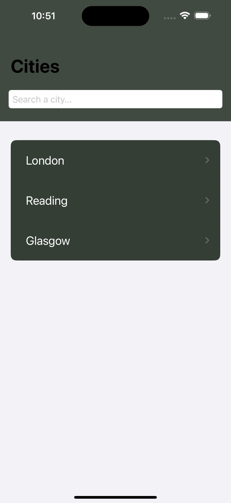
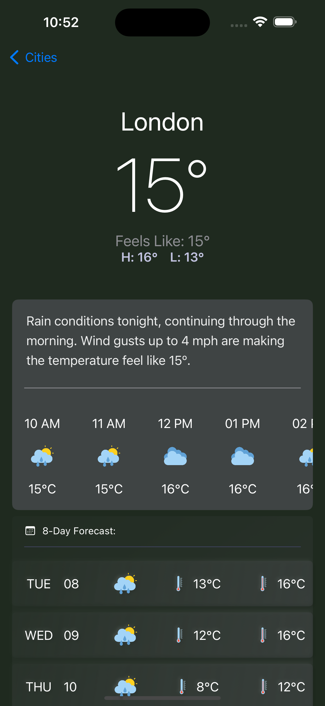

# Weather App

## Overview

The Weather App is a SwiftUI-based application that provides current weather information and forecasts for different cities. Users can search for cities, view current weather conditions, hourly forecasts, and an 8-day weather forecast.

## Getting Started

* Please reference openweathermap.org for api-usage
* Launch App, put your API KEY in setting view

## Screenshots

<p>
  
  
</p>

```
MyProject/
│
├── README.md
├── Readme-Assets/
│   ├── CityList.png
│   └── WeatherView.png

```

## Features

- **City Search**: Users can search for cities to add to their favorites.
- **Current Weather Conditions**: Displays temperature, humidity, and weather conditions.
- **Hourly Forecast**: Provides a forecast for the upcoming hours.
- **8-Day Forecast**: Displays daily weather forecasts with minimum and maximum temperatures.
- **Persistent Storage**: Cities are saved locally using UserDefaults.

## Architecture

This application follows the MVVM (Model-View-ViewModel) design pattern, which helps separate concerns and promotes better code organization and testability.

### Components

1. **Models**:
   - `WeatherRequestModel`: Represents the parameters required for a weather API request.
   - `WeatherResponse`: Decodable model representing the structure of the weather data received from the API.
   - `CityButtonView`: A simple struct representing a city with its name and unique identifier.

2. **ViewModels**:
   - `HomeViewModel`: Manages the list of cities, handling search queries and data persistence.
   - `WeatherViewModel`: Handles fetching and processing weather data for a selected city.

3. **Views**:
   - `ContentView`: The main entry point of the app.
   - `HomeView`: Displays the list of cities and a search bar.
   - `CityWeatherView`: Shows the weather details for a selected city.
   - `WeatherContainerView`: Contains the current weather and forecasts.
   - `CurrentConditionsView`, `HourlyForecastView`, `DailyForecastView`: Display specific weather information.

4. **Networking**:
   - `NetworkManager`: Provides networking functionalities with support for completion handlers, async-await, and Combine publishers. It handles API requests and responses, manages errors, and decodes JSON data into Swift models.
   
## API Reference

#### Get picture of the day

```https
  GET https://api.openweathermap.org/data/3.0/onecall?lat=51.5281798&lon=-0.4312316&exclude=minutely&appid=api-key
```

| Parameter | Type     | Description                |
| :-------- | :------- | :------------------------- |
| `api_key` | `string` | **Required**. Your API key |
| `lat`     | `string` | **Required**. lattitude of the city |
| `lon`     | `string` | **Required**. longitude of the city |
| `exclude` | `string` | **Optional**. It should be a comma-delimited list (without spaces). Available values: current, minutely, hourly, daily, alerts |
| `units`   | `string` | **Optional**. Units of measurement. standard, metric and imperial units are available |

## Networking

The `NetworkManager` class handles all networking tasks, including fetching weather data from the OpenWeather API. It supports:

- **Completion Handlers**: Allows you to execute a network request and handle the result asynchronously.
- **Async-Await**: Provides a modern approach to asynchronous programming, making the code more readable.
- **Combine Publishers**: Utilizes the Combine framework to return a publisher, allowing for reactive programming.

### Example Usage

Here’s an example of how you can fetch weather data using the `NetworkManager`:

```swift
let networkManager = NetworkManager()
let request = WeatherRequestModel(city: "London", latitude: "51.5074", longitude: "-0.1278", excludeFields: "minutely", units: "metric")

networkManager.execute(request: request)
    .sink(receiveCompletion: { completion in
        switch completion {
        case .finished:
            print("Request completed.")
        case .failure(let error):
            print("Error: \(error)")
        }
    }, receiveValue: { weatherResponse in
        print("Weather data: \(weatherResponse)")
    })
```
## Tech Stack

**Client:** Swift 5, iOS 16.0 onwards

### Prerequisites

- Xcode 13 or later
- iOS 15.0 or later

### Installation

Clone the repository:
   ```bash
   git clone https://github.com/yourusername/weather-app.git
   cd weather-app
   ```
   
   ```
   Build and run the project:
   Select your target device or simulator in Xcode, and hit Cmd + R to build and run the project.
   ```
